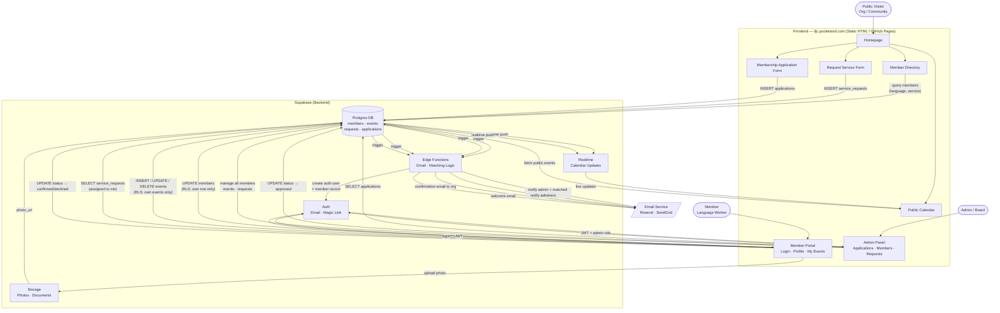

# ILJC — Backend Architecture Decision & Data Flow

## 1. Requirements

| Requirement | Detail |
|---|---|
| Member authentication | Workers log in to manage their own profile and events |
| Self-service directory | Members edit their own languages, services, bio, photo |
| Member-editable calendar | Members post/edit their own availability and events |
| Public search | Visitors filter by language, service type, location |
| Service request intake | Organizations submit requests; routed to matched members |
| Membership application | New workers apply to join the cooperative |
| Email notifications | Booking confirmations, application status, event reminders |
| Admin / governance | Board manages member accounts, reviews applications |
| Scale | ~50 members, ~200–500 events/year, ~100 service requests/year |
| Values | Open-source preferred; no vendor lock-in; low cost |

---

## 2. Backend Comparison

| Criteria | Airtable | Supabase | Headless CMS (Sanity/Contentful) | Firebase |
|---|---|---|---|---|
| **Built-in auth** | ❌ None | ✅ Full (email, magic link, OAuth) | ❌ None | ✅ Full |
| **Member self-service** | ⚠️ Via forms only; no portal | ✅ Row-level security per member | ❌ Not designed for this | ✅ Yes |
| **Calendar support** | ⚠️ Admin view only | ✅ Custom; real-time updates | ❌ No | ✅ Custom |
| **Complex queries** | ⚠️ Limited filtering | ✅ Full SQL (Postgres) | ❌ No | ⚠️ NoSQL limits |
| **File/photo storage** | ⚠️ Attachments only | ✅ Built-in S3-compatible | ⚠️ Asset CDN only | ✅ Cloud Storage |
| **Email / serverless** | ⚠️ Automations (paid) | ✅ Edge Functions | ❌ No | ✅ Cloud Functions |
| **Real-time** | ❌ No | ✅ Yes | ❌ No | ✅ Yes |
| **Open source / self-hostable** | ❌ Proprietary | ✅ Fully open source | ❌ Proprietary | ❌ Google lock-in |
| **Free tier** | ⚠️ 1,200 records; $20/user | ✅ 500MB DB, 50k MAU auth | ⚠️ Limited | ✅ Generous |
| **Coop values alignment** | ❌ Poor | ✅ Strong | ⚠️ Neutral | ❌ Google dependency |
| **Dev complexity** | Low | Medium | Low | Medium |

---

## 3. Decision: Supabase ✅

**Supabase is the clear choice for ILJC.**

### Why

1. **Auth is the core requirement.** Members need to log in and self-manage — Airtable and headless CMSs can't do this without bolting on a separate auth system. Supabase auth is built for exactly this use case.

2. **Row-level security (RLS) eliminates custom permission logic.** A single Postgres policy (`auth.uid() = member_id`) ensures María can only edit María's profile and events — no application-layer logic required.

3. **Free tier comfortably covers ILJC's scale.** 50 members + 500 events/year + 100 requests/year is a fraction of Supabase's free limits (500MB DB, 50,000 MAU).

4. **Open source and self-hostable.** When the coop is ready, they can move to a self-hosted instance and own their data entirely — a strong alignment with cooperative values.

5. **Postgres handles the hard queries.** "Find all members who speak Arabic, offer medical interpretation, and are available on Thursdays" requires joins and filters that NoSQL or Airtable can't handle cleanly.

6. **Single platform.** Auth, database, file storage (photos, documents), real-time calendar, and serverless functions for email — all in one service, one bill, one dashboard.

---

## 4. Database Schema

```sql
-- Lookup tables
create table languages (
  id   serial primary key,
  name text not null unique,  -- "Spanish", "Burmese", "Arabic" ...
  code text                   -- ISO 639-1 where applicable
);

create table service_types (
  id   serial primary key,
  name text not null unique   -- "Interpretation", "Translation", "Training" ...
);

-- Core member record (public-facing fields)
create table members (
  id              uuid primary key references auth.users on delete cascade,
  full_name       text not null,
  display_name    text,
  bio             text,
  photo_url       text,
  location        text,               -- neighborhood / city area
  website         text,
  is_active       boolean default true,
  is_public       boolean default true,
  joined_at       timestamptz default now(),
  updated_at      timestamptz default now()
);

-- Many-to-many: member ↔ language
create table member_languages (
  member_id   uuid references members(id) on delete cascade,
  language_id int  references languages(id),
  proficiency text check (proficiency in ('native','fluent','professional')),
  primary key (member_id, language_id)
);

-- Many-to-many: member ↔ service type
create table member_services (
  member_id       uuid references members(id) on delete cascade,
  service_type_id int  references service_types(id),
  primary key (member_id, service_type_id)
);

-- Calendar events (member-posted availability or services)
create table events (
  id              uuid primary key default gen_random_uuid(),
  member_id       uuid references members(id) on delete cascade,
  title           text not null,
  description     text,
  event_type      text,               -- "availability", "training", "community", "service"
  location        text,
  is_virtual      boolean default false,
  starts_at       timestamptz not null,
  ends_at         timestamptz,
  is_all_day      boolean default false,
  price           numeric(8,2),
  max_attendees   int,
  is_public       boolean default true,
  created_at      timestamptz default now()
);

-- Incoming service requests from organizations
create table service_requests (
  id                  uuid primary key default gen_random_uuid(),
  org_name            text not null,
  contact_name        text not null,
  contact_email       text not null,
  contact_phone       text,
  service_type_id     int  references service_types(id),
  language_id         int  references languages(id),
  requested_date      date,
  requested_time      text,
  duration_hours      numeric(4,1),
  location            text,
  is_virtual          boolean default false,
  notes               text,
  status              text default 'pending'
                        check (status in ('pending','matched','confirmed','completed','cancelled')),
  assigned_member_id  uuid references members(id),
  created_at          timestamptz default now()
);

-- Membership applications
create table applications (
  id              uuid primary key default gen_random_uuid(),
  full_name       text not null,
  email           text not null,
  phone           text,
  languages       text[],             -- free-text until approved
  services        text[],
  statement       text,               -- "why do you want to join?"
  resume_url      text,
  status          text default 'pending'
                    check (status in ('pending','reviewing','approved','declined')),
  reviewed_by     uuid references members(id),
  reviewed_at     timestamptz,
  notes           text,
  created_at      timestamptz default now()
);

-- Row-level security policies
alter table members          enable row level security;
alter table events           enable row level security;
alter table service_requests enable row level security;

-- Members can read all public profiles; update only their own
create policy "public members visible"   on members for select using (is_public = true);
create policy "members update own row"   on members for update using (auth.uid() = id);

-- Events: public can read public events; members manage their own
create policy "public events visible"    on events for select using (is_public = true);
create policy "members insert own events" on events for insert with check (auth.uid() = member_id);
create policy "members update own events" on events for update using (auth.uid() = member_id);
create policy "members delete own events" on events for delete using (auth.uid() = member_id);

-- Service requests: only admins and assigned member can see details
create policy "assigned member sees request"
  on service_requests for select
  using (auth.uid() = assigned_member_id or auth.role() = 'service_role');
```

---

## 5. Data Flow Diagram



---

## 6. Integration Architecture

```
GitHub Pages (static)
  └── index.html, services.html, calendar.html, directory.html
  └── member-portal/ (SPA or multi-page, vanilla JS or lightweight framework)
        └── login.html
        └── profile.html
        └── my-events.html
        └── requests.html

Supabase (hosted, free tier)
  └── Auth            → member login / session management
  └── Postgres DB     → all data (members, events, requests, applications)
  └── Row-Level Sec.  → members can only touch their own rows
  └── Storage         → member photos, translated docs
  └── Realtime        → calendar live-updates via websocket
  └── Edge Functions  → email triggers, member matching algorithm

Email (Resend — free tier: 3,000 emails/month)
  └── New service request → admin + matched members
  └── Application received → admin
  └── Application approved → welcome email to new member
  └── Booking confirmed → org contact
```

---

## 7. Implementation Phases

### Phase 1 — Static + Forms (no auth yet)
- Service request form → Supabase table → admin email via Edge Function
- Membership application form → Supabase table → admin email
- Public calendar from Supabase `events` table (admin-managed for now)
- Public directory from Supabase `members` table (admin-managed for now)

### Phase 2 — Member Portal
- Supabase Auth for member login
- Members edit their own profile (name, bio, languages, services, photo)
- Members post/edit their own events
- Members view and respond to service requests assigned to them

### Phase 3 — Admin Panel + Governance
- Application review flow (approve → auto-creates member account)
- Member management dashboard
- Basic reporting (requests volume, languages served, member activity)

### Phase 4 — Advanced
- Automated member matching algorithm (language + service + availability scoring)
- Booking calendar with conflict detection
- iCal export / subscribe link for public calendar
- Language selector / translated UI
- Member earnings tracking and payout records
